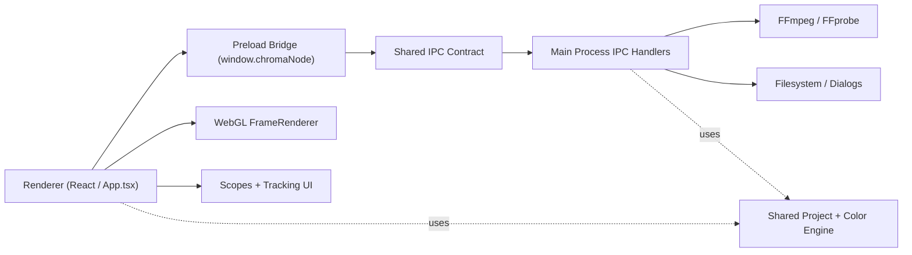
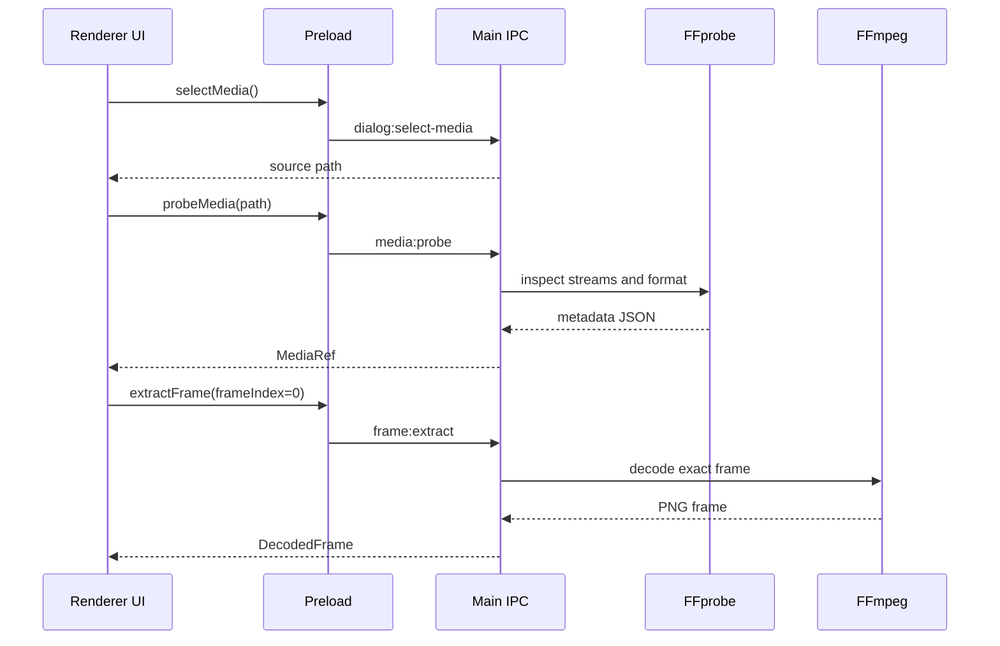
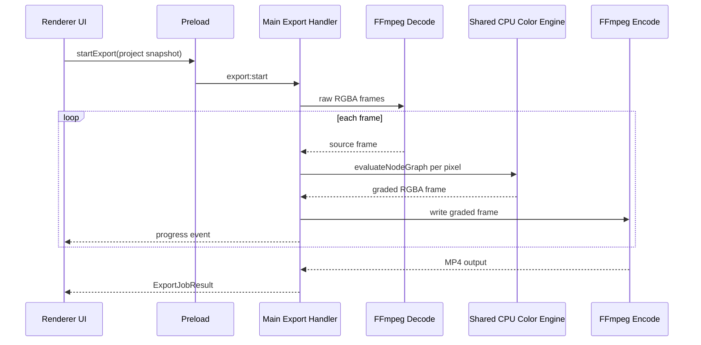

# Architecture

This project uses a split Electron architecture with a deliberately shared domain model.

## High-Level Map

```text
Renderer UI (React)
  -> Preload bridge
    -> IPC contract
      -> Main process
        -> FFmpeg / FFprobe / filesystem / dialogs

Shared domain modules
  -> project schema
  -> color engine
  -> typed IPC definitions
```

## Architecture Diagram



## Process Boundaries

### Renderer

Owned by `src/renderer/`.

Responsibilities:

- maintain UI state
- drive playback controls and scrub state
- edit node parameters
- show scopes
- run translation tracking UI flow
- render the live viewer through WebGL

Key file:

- `src/renderer/App.tsx`

### Preload

Owned by `src/preload/preload.cts`.

Responsibilities:

- expose a narrow `window.chromaNode` API
- prevent the renderer from receiving unrestricted Electron access

### Main Process

Owned by `src/main/`.

Responsibilities:

- open native file dialogs
- save and open project files
- detect FFmpeg and FFprobe
- probe media metadata
- extract exact preview frames
- relink missing media
- run export jobs and emit progress

### Shared Modules

Owned by `src/shared/`.

Responsibilities:

- define the project schema
- define node graph data structures
- sanitize and validate project and node data
- implement the reference CPU color pipeline
- generate the GLSL used by preview rendering
- define the IPC contract used by preload, renderer, and main

This is the architectural center of gravity.

## Request Lifecycle Example

Importing media is a good example of the full stack:

1. `App.tsx` calls `window.chromaNode.selectMedia()`.
2. `preload.cts` forwards the request through `ipcRenderer.invoke`.
3. `src/main/ipc.ts` handles `dialog:select-media`.
4. The main process opens a native dialog and returns the selected path.
5. The renderer then calls `probeMedia`.
6. `src/main/mediaProbe.ts` runs FFprobe and converts the result into `MediaRef`.
7. The renderer updates project state and requests the first decoded frame.
8. `src/main/frame.ts` runs FFmpeg and returns a PNG data URL for preview.

The renderer stays declarative. The main process stays imperative.

## More Detailed Data Flows

### Import + First Preview Frame



### Export



## Preview Pipeline

Preview uses the GPU:

1. The renderer loads a decoded frame or a live HTML video frame.
2. `FrameRenderer` uploads the frame as a texture.
3. `generateColorFragmentShader()` from `src/shared/colorEngine.ts` builds the fragment shader source for the current node count.
4. Node parameters are uploaded as uniforms.
5. The shader evaluates the serial grade and renders the result into the canvas.

Why this matters:

- the viewer remains interactive
- playback can use a live video source
- the renderer can show original, graded, split, and matte modes without round-tripping through the main process

### Preview Responsibilities Broken Down

- `App.tsx` owns node and playback state
- `FrameRenderer` owns WebGL resource lifecycle
- `generateColorFragmentShader()` adapts the shader to the current node count
- `resolveTrackedNode()` ensures tracked offsets are reflected in the displayed masks and grade

The preview path optimizes for interactivity, not portability.

## Export Pipeline

Export uses the CPU:

1. `src/main/exportProject.ts` builds an export job snapshot.
2. FFmpeg decodes the source clip into raw RGBA frames.
3. `renderRgbaFrame()` loops over pixels.
4. Each pixel is evaluated with `evaluateNodeGraph()`.
5. The graded frame is streamed back into FFmpeg.
6. FFmpeg encodes the result to H.264 MP4.

Why this matters:

- export does not depend on renderer state or GPU availability
- the main process can run long-lived jobs and send progress updates
- preview and export can still match because they share the same node model and math definitions

### Export Responsibilities Broken Down

- job validation and path setup
- overwrite protection
- raw decode orchestration
- pixel-by-pixel CPU grading
- progress reporting
- cancellation
- finalization and output probing

## Preview And Export Parity

The project avoids a common video-tool failure mode: the preview path and export path silently diverging.

Parity is maintained by:

- putting node data structures in `src/shared/colorEngine.ts`
- using `evaluateNodeGraph()` as the reference CPU implementation
- generating preview shader logic from the same conceptual model
- resolving tracked window offsets in both paths

This is why grading logic should usually not live in `App.tsx` or `exportProject.ts` directly.

### Practical Parity Rule

If you change anything that affects how a pixel should look, ask:

- does the CPU evaluator change?
- does shader generation change?
- do uniforms or node serialization change?

If the answer is yes to only one of these, you probably have a parity bug.

## Persistent Data Model

Projects are versioned JSON files.

The schema is defined in `src/shared/project.ts`.

Important behaviors:

- invalid values are often clamped or defaulted
- too many nodes are truncated to `MAX_SERIAL_NODES`
- unsupported schema versions fail
- missing media does not destroy the project; it triggers relink flow

This makes the format resilient, but it also means persistence bugs can be subtle if you forget validation.

### Why Validation Is So Strict

Projects can come from:

- the current UI
- old saved files
- manually edited JSON
- partially corrupted data

The project loader therefore does two related but different jobs:

- reject unsupported structure
- rescue recoverable values by clamping and defaulting them

## Important Modules

### `src/shared/project.ts`

Defines:

- `ChromaProject`
- schema versioning
- validation and sanitization
- serialization

### `src/shared/colorEngine.ts`

Defines:

- node data types
- primary correction math
- qualifier and window masks
- tracking resolution
- serial node evaluation
- fragment shader generation

It is the conceptual heart of the repo.

### `src/renderer/webgl/FrameRenderer.ts`

Defines:

- the WebGL program lifecycle
- uniform upload
- playback-aware texture updates
- viewer rendering modes

This module is intentionally low on grading theory and high on GPU plumbing.

### `src/renderer/scopes/scopeAnalysis.ts`

Defines:

- graded frame generation for scope sampling
- waveform histogram creation
- vectorscope histogram creation

### `src/renderer/tracking/templateTracker.ts`

Defines:

- translation-only template matching
- texture checks
- search radius scaling
- confidence scoring

### `src/main/exportProject.ts`

Defines:

- export job setup
- frame decode/encode loop
- per-pixel CPU rendering
- progress and cancellation behavior

This module is intentionally high on orchestration and low on grade semantics.

## State Ownership

State is spread across a few layers on purpose:

- React state in `App.tsx` owns current UI/project session state
- project JSON owns persisted user intent
- shared engine code owns grade semantics
- main-process export jobs own long-running export state

Do not try to collapse all of this into one giant store. The boundaries map to runtime realities.

## Coordinate Systems Used In The App

You will encounter several coordinate systems:

- source pixel coordinates for decoded/exported frames
- normalized `0..1` image coordinates for windows and point sampling
- canvas or SVG pixel coordinates for on-screen overlay editing
- frame indices for playback/tracking/export

Many bugs come from mixing these spaces accidentally.

## Security Model

This is not a browser-only app, so Electron security boundaries matter.

Important choices already present in the app:

- `contextIsolation: true`
- `nodeIntegration: false`
- renderer only accesses privileged actions through a narrow bridge

That means new privileged capabilities should go through:

1. typed IPC contract
2. preload bridge exposure
3. main-process validation

## Testing Strategy By Layer

- `src/shared/*.test.ts`: deterministic math and schema validation
- `src/renderer/*.test.ts`: renderer-side logic such as playback or scopes
- `src/main/*.test.ts`: FFmpeg integration boundaries, export helpers, relink validation

For this architecture, small deterministic unit tests usually provide more value than giant end-to-end tests.

## How To Decide Where A New Feature Goes

If the feature:

- changes the meaning of a node parameter: start in `src/shared/`
- only changes UI controls or layout: start in `src/renderer/`
- needs OS access or FFmpeg: start in `src/main/`
- adds a new cross-process action: update `src/shared/ipc.ts`, `src/preload/preload.cts`, and `src/main/ipc.ts`

## Architecture Constraints Worth Respecting

- Keep the color engine React-free.
- Keep FFmpeg calls out of the renderer.
- Keep project schema changes explicit and validated.
- Keep preview/export parity in mind whenever a grading rule changes.
- Prefer normalized coordinates and typed data at the boundaries.

## Learn More

Continue with [Video Editing and Color Theory](./video-editing-and-color-theory.md) for the concepts behind the color pipeline, then [External Resources](./external-resources.md) for official reference material.
